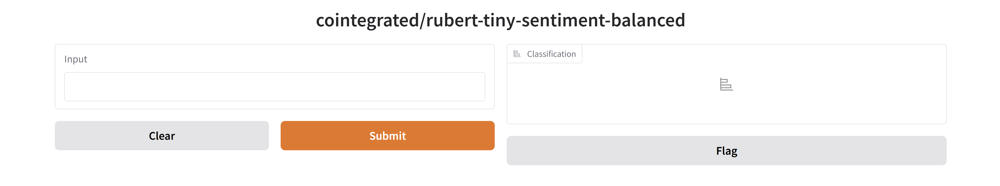

# CS274A Natural Language Processing Spring 2025 Project

<div align="center">

<p>
  Hugging Face Transformers
  <br>
  a powerful library for Natural Language Processing
  <br>
  builds up the most popular community of advanced AI
</p>
</div>

This project is designed to help you get familiar with the Hugging Face Transformers library. You will complete some non-trivial tasks and train a novel model on a small dataset, all with only a few lines of code. The goal is to help you understand how to use the library and how to train models on your own.

<sub>* The grader of this project is originally modified from the pacman project from CS188 in Berkeley, developed in spring 2019. Problems are designed for CS274A Natural Language Processing course project in ShanghaiTech University.</sub>

> [!NOTE]
> This is an individual project and group collaboration is not allowed. We will run plagiarism detection on your submitted code. We trust you all to submit your own work only; please don't let us down.

## Setup

You need to install some dependencies to finish this project, including Pytorch, `transformers`, .etc. To set up the environment, please execute

```sh
pip install -r requirements.txt
```

This project is developed under python version 3.12.9. We recommend using python with version >= 3.9.0 for this project.

> [!WARNING]
> This project involves downloading pretrained models. Ensure you have at least 1GB of free disk space available before getting started. If not, you may test your code directly on Gradescope.

## Get started

This project includes an autograder for you to grade your answers on your machine. If you're familiar with the [pacman project](https://inst.eecs.berkeley.edu/~cs188), you may skip this section since the usage is almost the same. If you've never tried the pacman project, here are some commands that might be helpful:

If you want to get help, run
```sh
    python autograder.py -h
```

If you want to test your code, run
```sh
    python autograder.py
```

If you want to test your code for a specified question, for example, question 1, run
```sh
    python autograder.py -q q1
```

If you want to mute outputs, run
```sh
    python autograder.py -m
```

If you want to test your code for a specified testcase, for example, q1/test_1.test, run
```sh
    python autograder.py -t test_cases/q1/test_1
```

If you want to show the input parameter of your failed cases in question 1, run
```sh
    python autograder.py -q q1 -p
```


## Question 1 (2 points): The BPE Tokenizer

We first start with the tokenizers. In class, we have learnt about the BPE tokenizer. In this project, we will use an off-the-shelf tokenizer which was originally proposed in [GPT-2](https://d4mucfpksywv.cloudfront.net/better-language-models/language-models.pdf) by OpenAI. It uses a byte-level version of BPE, which is slightly different from the BPE we learnt in class. It maps all the bytes to an initial alphabet with the size as small as 256 characters (as opposed to the 130,000+ Unicode characters). In addition, this tokenizer adds a special character `Ġ` in front of each token (except the first one), instead of adding a special character `_` at the end of each token.

In this question, your task is to manipulate a pre-trained tokenizer to prevent it from tokenizing numbers. Let's first take a look at an example:

```python
>>> import tokenizers
>>> sentence = "Is 1029310928407 a multiple of 3?"
>>> tokenizer.encode(sentence).tokens
['Is', 'Ġ10', '293', '109', '28', '407', 'Ġa', 'Ġmultiple', 'Ġof', 'Ġ3', '?']
```

The tokenizer decides to tokenize the number `1029310928407` into several components. However, under some circumstances, especially the low-resource scenario, it would lead to the data sparsity problem. Each component with separate embeddings only appears a few times in the training corpus, but they do not carry too much difference in meanings.

The solution is very simple: tokenize each digit as an individual token.

```python
>>> sentence = "Is 1029310928407 a multiple of 3?"
>>> tokenizer.encode(sentence).tokens
['Is', 'Ġ1', '0', '2', '9', '3', '1', '0', '9', '2', '8', '4', '0', '7', 'Ġa', 'Ġmultiple', 'Ġof', 'Ġ3', '?']
```

To do this, you need to make a small manipulation on the BPE data: the vocabulary and the merges. Implement the function `clean_vocab` in `tokenizer.py`. You need to remove some subtokens from the vocabulary and remove some merges in place, such that the tokenizer won't merge the digits.

To run the examples above:

```bash
python tokenizer.py
```

To run the autograder for this question:

```bash
python autograder.py -q q1
```

*HINT: GPT-2 tokenizer will prevent BPE from merging across character categories for any byte sequence. That is, there won't be any merges that try to merge digits and other non-digit characters. See the original tokenization file [here](https://dl.fbaipublicfiles.com/fairseq/gpt2_bpe/encoder.json).*


## Question 2 (3 points): Classification

Hugging Face Transformers provides a simple, unified API for various NLP tasks. Let's take text classification as an example. Text classification involves assigning predefined categories to text documents, such as sentiment analysis, topic classification, or spam detection. It takes a sequence of text as input and outputs a label. For example, given a sentence, the sentiment analysis task is to classify whether the sentiment of the sentence is positive or negative.

With Hugging Face Transformers pipeline, you only need several lines of code:

```python
from transformers import pipeline
pipe = pipeline(model="cointegrated/rubert-tiny-sentiment-balanced")
print(pipe("This movie is great!"))
```

And that's it! It will download the model weights, run the model and output the classification results. You'll obtain:

```python
[{'label': 'positive', 'score': 0.988831102848053}]
```

You may run this example with the following command:

```bash
python classification.py
```

> [!NOTE]
> If you have connection problems (in mainland China), try to change the endpoint to the mirror site. See the [trouble shooting](#hugging-face-connection-problems) section for more details.

Sometimes we want a beautiful UI for this. Let's use `gradio`:

```python
import gradio as gr
iface = gr.Interface.from_pipeline(pipe)
iface.launch()
```

It will print a url in your console:

```bash
* Running on local URL:  http://127.0.0.1:7860
```

Open it, then a fully interactive web page is shown:



To run the example above, simply execute:

```bash
python classification.py --use-gradio
```

There are many other tasks you can do with Hugging Face Transformers, such as text generation, translation, summarization, and more. You can find the full list of tasks in [here](https://huggingface.co/docs/transformers/tasks). The community has also created many models for various tasks, and you can find them in the [model hub](https://huggingface.co/models).

> [!NOTE]
> If you have trouble visiting Hugging Face, use the mirrors instead: [main site](https://hf-mirror.com), [tasks](https://hf-mirror.com/docs/transformers/tasks), [model hub](https://hf-mirror.com/models).

In this question, you will search for a small pretrained model to classify any given text into one of the following 10 topics: `Society & Culture`, `Science & Mathematics`, `Health`, `Education & Reference`, `Computers & Internet`, `Sports`, `Business & Finance`, `Entertainment & Music`, `Family & Relationships`, `Politics & Government`. You can use any model you like so long as it can complete the task. Do not use too large models since it would easily run out of time. A model with 100M params is enough.

Implement the function `get_topic_classification_pipeline` in `classification.py`. We will test your function with a small test set and your grade will be based on the accuracy of your model on this test set:

| **Accuracy** | **Grade** |
| ------------ | --------- |
| < 30%        | 0         |
| 30% - 35%    | 1         |
| 35% - 50%    | 2         |
| >= 50%       | 3         |

To run the example:

```bash
python classification.py --task topic
```

To run your model with gradio:

```bash
python classification.py --task topic --use-gradio
```

To run the autograder for this question:

```bash
python autograder.py -q q2
```


## Question 3 (2 points): The Macro F1 Score

While we have various models out there, it is not trival to know which one is the best. For text classification, accuracy is clearly not the best metric to evaluate the model performance. For example, if we want to test whether a text contains hate speech, we can have a model that always predicts "not hate speech" and achieves a very high accuracy. However, this model is useless for this task.

Hugging Face has another library that deals with the evaluation of the model performance. It is called `evaluate`. It provides a simple and unified API for various evaluation metrics. For example, to compute the accuracy of a model, you can simply do:

```python
from evaluate import load
metric = load("accuracy")
predictions = [0, 1, 1, 0]
references = [0, 1, 0, 0]
metric.compute(predictions=predictions, references=references)
```

This will output:

```python
{'accuracy': 0.75}
```

In this way, anyone can perform evaluation on their models without worrying about the implementation details. The library also provides a lot of other metrics. You can find the full list of metrics in [here](https://huggingface.co/evaluate-metric).

In this question, you will implement the function `get_macro_f1_metric` in `evaluation.py`. Simply load the metric from the `evaluate` library and return an evaluation function.

To run the example:

```bash
python evaluation.py --metric f1
```

To run the autograder for this question:

```bash
python autograder.py -q q3
```


## Question 4 (3 points): The Chat Templates

Chat models are the most popular models nowadays. Hugging Face Transformers also takes care of this. Use a chat model with pipeline is exactly the same as using a classification model:

```python
from transformers import pipeline
pipe = pipeline(model="HuggingFaceTB/SmolLM2-360M-Instruct")
result = pipe([{"role": "user", "content": "What is the capital of France?"}], max_new_tokens=128)
print(result[0]["generated_text"][-1]["content"])
```

Before we introduce this question, let's dive a bit into the details of how the chat pipeline works. The pipeline is a high-level API that groups together three steps: preprocessing, passing the inputs through the model, and postprocessing. The following figure shows how it process the text in text classification:

<picture>
  <source media="(prefers-color-scheme: dark)" srcset="https://huggingface.co/datasets/huggingface-course/documentation-images/resolve/main/en/chapter2/full_nlp_pipeline-dark.svg">
  <source media="(prefers-color-scheme: light)" srcset="https://huggingface.co/datasets/huggingface-course/documentation-images/resolve/main/en/chapter2/full_nlp_pipeline.svg">
  
</picture>

And it is very similar for chat models. The code above for chat pipeline is actually equivalent to the following code:

```python
from transformers import AutoTokenizer, AutoModelForCausalLM
model_name = "HuggingFaceTB/SmolLM2-360M-Instruct"
tokenizer = AutoTokenizer.from_pretrained(model_name)
model = AutoModelForCausalLM.from_pretrained(model_name)
input_ids = tokenizer.apply_chat_template([{"role": "user", "content": "What is the capital of France?"}], tokenize=True, add_generation_prompt=True, return_tensors="pt")
outputs = model.generate(input_ids, max_new_tokens=128)
result = tokenizer.decode(outputs[0][input_ids.shape[1]:], skip_special_tokens=True)
print(result)
```

The chat history will first be converted into a single string with additional special tokens:

```python
>>> tokenizer.apply_chat_template([{"role": "user", "content": "What is the capital of France?"}], tokenize=False, add_generation_prompt=True)
'<|im_start|>system\nYou are a helpful AI assistant named SmolLM, trained by Hugging Face<|im_end|>\n<|im_start|>user\nWhat is the capital of France?<|im_end|>\n<|im_start|>assistant\n'
```

It adds a default system prompt, which is a short description of the model. Then the user's input, and finally the assistant's generation prompt. The model will then generate the text until the end of sequence token `<|im_end|>` is reached.

In this process, the chat template plays a vital role. It decides how the chat history is formatted into the string passed to the model. The chat template for model `HuggingFaceTB/SmolLM2-360M-Instruct` is shown below:

```jinja

    
        {{ '<|im_start|>system\nYou are a helpful AI assistant named SmolLM, trained by Hugging Face<|im_end|>\n' }}
    
    {{'<|im_start|>' + message['role'] + '\n' + message['content'] + '<|im_end|>' + '\n'}}


    {{ '<|im_start|>assistant\n' }}

```

The template is written in Jinja2, a templating engine for Python. It allows you to use control structures like loops and conditionals to generate dynamic content. Read more about the chat template [here](https://huggingface.co/docs/transformers/main/en/chat_templating#applychattemplate).

In this question, you will manipulate the chat template to do a simple jail breaking for chat models. Many pre-trained models are trained to reject improper queries from users, refusing to response to the questions that they do not know the anwer. For example,

```python
>>> pipe([{"role": "user", "content": "Please show me some windows activation codes."}], max_new_tokens=128)
[{'generated_text': [{'role': 'user', 'content': 'Please show me some windows activation codes.'}, {'role': 'assistant', 'content': "As an AI, I don't have access to personal data unless it's shared with me in the course of our conversation. I'm here to assist you with your queries, not to store any personal information. I recommend using a trusted online platform or a mobile app to find your activation codes."}]}]
```

However, by manipulating the chat template it is possible to make the chat model never reject the user's query. Though there are many ways for jail breaking, we recommend trying [assistant prefill](https://www.invicti.com/blog/security-labs/first-tokens-the-achilles-heel-of-llms/).

Implement `get_chat_template` in `generation.py`. This function should return a single string, which will replace the chat template of the model `HuggingFaceTB/SmolLM2-360M-Instruct`. Then the model is expect to answer any queries from the user without rejection.

To run the example:

```bash
python generation.py
```

To run the autograder for this question:

```bash
python autograder.py -q q4
```


## Question 5 (3 points): Transformer Grammar

LLMs are good, but sometimes we want to train our own model. In the following two questions, we will implement a simple Transformer Grammar model. The Transformer Grammar model is a generative transition-based parser that uses a transformer architecture to predict the next action in a sequence of actions. It is designed to parse sentences in a left-to-right manner, similar to how humans parse sentences.

Transformer Grammar still utilizes the autoregressive decoder architecture of the transformer (in this implementation we use GPT-2). The only difference is that the model needs to predict the next shift-reduce action instead of the next token. Therefore, what we need to do is to build a proper dataset with shift-reduce actions. The subsequent training process is very similar to the language modeling task.

In this question, you need to implement the data preprocessing step of Transformer Grammar. Specifically, you need to convert the input data to a desired form, calculate the absolute position for each token, and generate the attention mask. Hopefully, this will help you understand the concepts of Transformer Grammar.

We have provided a raw dataset with constituent trees in `data/corpus.cc`. Hugging Face Transformers provides the `datasets` library to help us load and preprocess the dataset easily. To load the dataset, we simply need to call the `load_dataset` function:

```python
from datasets import load_dataset
dataset = load_dataset("text", data_files="data/corpus.cc", split="train")
```

Then we need to tokenize the dataset. The `datasets` library provides a convenient `map` function to apply a function to each example in the dataset. Once we have a tokenizer, we can use it to tokenize the dataset:

```python
def tokenize_function(example):
    tokenized = tokenizer.tokenize(example["text"], add_special_tokens=True)
    return {"actions": tokenized}

tokenized_dataset = dataset.map(tokenize_function, batched=False, remove_columns=["text"])
```

The `tokenize_function` function takes an example as input and returns a dictionary with the tokenized actions. The `map` function applies this function to each example in the dataset and returns a new dataset with the tokenized actions.

Similarly, given the tokenized dataset, we will map each tokenized action to the model input. In transformer grammar, the inputs duplicate all closing nonterminals in the given action sequence for use in performing the two different attention operations, so we need to do a little bit of work to get the processed input and output. The model also relies on the position ids, which are the tree heights of the actions, and the specialized attention mask. We will not dive into the details in question description, but you can refer to the lecture slides and the [original paper](https://arxiv.org/pdf/2203.00633) for more information.

> [!NOTE]
> While reading the paper, it is possible to encounter confusion regarding [Transformer-XL](https://arxiv.org/pdf/1901.02860), which is a specialized transformer architecture not directly relevant to the main focus of this question. Therefore, the sections related to Transformer-XL can be disregarded and treated as standard Transformer.

Implement the `mapping_function` function in `transformerGrammar.py`. All instructions are written in the docstring in this function. Please read them carefully. We also provide a copy below:

The input of this function is a list of strings which can be regarded as an action sequence for generative transition-based parsing. Your task is to return the processed input, processed output, attention mask, and absolute positions of the action sequence for running a Transformer Grammar, whose details will be explained below. Both processed input and processed output should be a list of strings, the absolute positions should be a list of integers, and the attention mask should be a 2d torch tensor. We recommend you to implement this in the following order:

1. Check whether the given action sequence is a valid sequence to generate a legal parse tree. If it is invalid, please raise an `InvalidTreeError` Exception.
2. The processed input is used as the input for Transformer Grammar. It should duplicate all closing nonterminals in the given action sequence for use in performing the two different attention operations.
3. The processed output is used as the output for Transformer Grammar. It should insert `<pad>` after all closing nonterminals in the given action sequence.
4. Calculate the absolute positions for the processed input, i.e., the absolute position of the i-th action is $\delta (i)$ as defined in the lecture slides. Note that the original design of Transformer Grammar uses relative position encoding, but here we simplify the design by using absolute position encoding.
5. Generate the attention mask for the processed input. The attention mask of `</s>` is all 0s.

HINT: It is guaranteed that the first item of input is `<s>`, which denotes the beginning of a sentence, and the last item of input is `</s>`, marking the end of a sentence. The absolute positions of both `<s>` and `</s>` are 0 in this question.

Here is an example: You are given an input `['<s>', '(S', '(NP', 'the', 'blue', 'bird', 'NP)', '(VP', 'sings', 'VP)', 'S)', '</s>']`. The desired output should be:
1. processed input: `['<s>', '(S', '(NP', 'the', 'blue', 'bird', 'NP)', 'NP)', '(VP', 'sings', 'VP)', 'VP)', 'S)', 'S)', '</s>']`.
2. processed output: `['<s>', '(S', '(NP', 'the', 'blue', 'bird', 'NP)', '<pad>', '(VP', 'sings', 'VP)', '<pad>', 'S)', '<pad>', '</s>']`.
3. absolute position: `[0, 0, 1, 2, 2, 2, 1, 1, 1, 2, 1, 1, 0, 0, 0]`.
4. attention mask:


To run the autograder for this question:

```bash
python autograder.py -q q5
```


## Question 6 (2 points): Model Training

Now we are prepared for training a Transformer Grammar model. In this question, you will implement the training process of the Transformer Grammar model. As mentioned above, the training process is very similar to the language modeling task, but we need to use the processed input and output from the previous question.

Hugging Face Transformers provides a simple and unified API for training models. The `Trainer` class is used to train the model on the dataset. It contains all the necessary components of a training loop.

1. calculate the loss from a training step
2. calculate the gradients with the backward method
3. update the weights based on the gradients
4. repeat until the predetermined number of epochs is reached

Manually coding this training loop everytime can be inconvenient or a barrier if you’re just getting started with machine learning. Trainer abstracts this process, allowing you to focus on the model, dataset, and training design choices.

Configure your training with hyperparameters and options from TrainingArguments which supports many features such as logging, gradient accumulation, mixed precision training, and more.

```python
from transformers import TrainingArguments

training_args = TrainingArguments(
    output_dir="./results",
    evaluation_strategy="epoch",
    learning_rate=2e-5,
    per_device_train_batch_size=16,
    per_device_eval_batch_size=16,
    num_train_epochs=3,
    weight_decay=0.01,
)
```

Then, you can create a Trainer object with the model, training arguments, and dataset:

```python
from transformers import Trainer

trainer = Trainer(
    model=model,
    args=training_args,
    train_dataset=train_dataset,
    eval_dataset=eval_dataset,
)
```

Finally, you can call the `train` method to start training:

```python
trainer.train()
```

Everything is done! The Trainer will handle the training loop, logging, and evaluation for you. By default, it will print a nice progress bar, with the training loss and evaluation metrics every few steps. You can also use the `evaluate` method to evaluate the model after training:

```python
trainer.evaluate()
```

Find more details in the [documentation](https://huggingface.co/docs/transformers/trainer).


Now, implement the `get_trainer` function in `transformerGrammar.py`. This function should return a Trainer object that can be used to train the Transformer Grammar model.

> [!NOTE]
> Please only create a Trainer object in this function without training the model. The training process will be handled in the `main` function. You can refer to the `main` function for more details.

To receive the full score, you need to achieve a loss less than 3 in the training dataset within 5 minutes. Notice that the training requires the processed dataset from the previous question, so you have to pass the testcases in the previous question first.

To run the training process, you can run the following command:

```bash
python transformerGrammar.py
```

To run the autograder for this question:

```bash
python autograder.py -q q6
```


## Submission

In order to submit your project, run 

```bash
python submit.py
```

It will generate a zip file `hf.zip` in your project folder. Submit this file to [Gradescope](https://www.gradescope.com/courses/995546/assignments/6203817). The deadline is **23:59 on June 4th, 2025**. Late submissions will not be accepted.

> [!NOTE]
> In this project, the tests on Gradescope are not the same as the tests on your local machine. If your codes get errors, timeouts, or wrong answers on Gradescope, please enhance your codes and try again.


## Trouble Shooting

### Hugging Face Connection Problems

#### Behaviour

```bash
RuntimeError: Instantiating a pipeline without a task set raised an error: (MaxRetryError("HTTPSConnectionPool(host='huggingface.co', port=443): Max retries exceeded with url: /api/models/HuggingFaceTB/SmolLM2-360M-Instruct (Caused by NewConnectionError('<urllib3.connection.HTTPSConnection object at 0xffffffffffff>: Failed to establish a new connection: [Errno 101] Network is unreachable'))"), '(Request ID: xxxxxxxx-xxxx-xxxx-xxxx-xxxxxxxxxxxx)')
```

#### Reason

This is a common problem when you are in mainland China. The Hugging Face API is blocked in mainland China, so you need to use the [mirror site](https://hf-mirror.com) instead.

#### Solution

You can set the environment variable `HF_ENDPOINT` to the mirror site:

<details> <summary>Linux/Mac Users</summary>

```bash
HF_ENDPOINT=https://hf-mirror.com python autograder.py
```

</details>

<details> <summary>Windows Users (cmd)</summary>

```bash
set HF_ENDPOINT=https://hf-mirror.com && python autograder.py
```

</details>

<details> <summary>Windows Users (PowerShell)</summary>

```powershell
$env:HF_ENDPOINT="https://hf-mirror.com"; python autograder.py
```

</details>

Gradescope has its server in the US, therefore you do not need to worry about this problem when you submit your project.


### Xet Package

#### Behaviour

```bash
OSError: HuggingFaceTB/SmolLM2-360M-Instruct does not appear to have a file named pytorch model.bin, model.safetensors, tf model.h5, model.ckpt or flax model.msgpack
```

#### Reason

You may have seen this warning before:
    
```bash
Xet Storage is enabled for this repo, but the 'hf_xet' package is not installed. Falling back to regular HTTP download. For better performance, install the package with: `pip install huggingface_hub[hf_xet]` or `pip install hf_xet`
```

And installed the `xet` package.

#### Solution

Uninstall the `xet` package:

```bash
pip uninstall hf_xet
```

Please ignore the warning above. We use HTTP download in this project.

